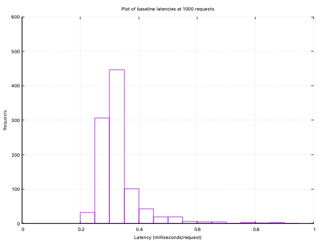

# HW5: Lies, statistics, and benchmarks

#### Author: Hien Nguyen

### How to run

To build the program,

```
./make
```

Then start the server,

```
./cache_server -m [maxmem]
```

By default, the client will send 1000 requests to the server. To adjust the number of requests, add the new number after the program executable:

```
./workload_generator [nreq]
```

### Part 1: Workload Generator

#### Workload composition

The GET/SET/DELETE request ratio is **68:17:15**. I overweight SET operations compared to DELETE operations to reduce invalidation misses and increase the hit rate.

#### Request sizes

To emulate the distribution of key and value sizes in Memcached's ETC pool, I use C++ [Extreme Value Distribution](http://www.cplusplus.com/reference/random/extreme_value_distribution/). Keys and values are strings generated based on the sizes randomly sampled from the Extreme Value distribution. More than 50% of key and value sizes are under 100B. The range of possible values is 0-250 bytes for key sizes, and 0-1M for value sizes.

#### Cache warmup

Before requests are sent to the server to measure the hit rate, server cache is warmed up with a preliminary run of ~100 client requests so that the cache is nearly filled with values. For a cache of maxmem 2048, the cache is warmed up with ~1900-2000 keys before the hit rate is observed.

### Hit rate

The observed hit rate is ~83% on average for a cache of maxmem 2048 run against 1000 client requests.

To reproduce this result, run the server with flag `-m 2048`. There is no need to change anything on the client side, as it naturally will send 1000 requests. The hit rate is reported after each run of the client code.

*It should be noted that the current program will crash at around 10^5 requests with a `connection failed: cannot assign requested address` error. My guess is that the server simply becomes overloaded at that point. It is safe to run the program with less than 10^5 requests.*


### Part 2: Baseline latency and throughput




95th-percentile latency: 0.503 ms/request

Mean throughput: 2689 requests/second

### Part 3: Sensitivity testing

I chose the following aspects to vary:

#### Size of maximum cache memory

Maxmem | Hit rate | p95 latency | Mean throughput
--- | --- | --- | ---
1024 | 0.508824 | 0.557 | 2533
4096 | 0.876652 | 0.507 | 2673

The GET hit rate drops to ~0.5 when the cache's maxmem is set to 1024B. This is to be expected as the rate of compulsory misses is typically higher with a smaller cache (provided that the number of requests remain the same), thus a reduced hit rate. The measurements for latency and throughput are comparable with the baseline for both cases.

#### Eviction policy

I replace the `nullptr` evictor in the baseline program to a First-In-First-Out evictor to get the following performance statistics.

Hit rate | p95 latency | Mean throughput
--- | --- | ---
0.50514 | 0.508 | 2916

Using a FIFO evictor seems to affect the cache's hit rate. As the cache evicts old values to make room for new ones, we can expect more invalidation misses and thus, a reduced hit rate.

#### Hash function

I use the C++ standard hashing function to replace the custom hash function in the baseline program.

Hit rate | p95 latency | Mean throughput
--- | --- | ---
0.839706 | 0.419 | 3370

All measurements are comparable with the baseline, with the exception of the mean throughput. Here the observed throughput is slightly higher than the baseline. This could be because the C++ standard hash function is simpler than the one we employed, thus allowing for faster key placement and higher throughput as a result.

#### Load factor

Load factor | Hit rate | p95 latency | Mean throughput
--- | --- | --- | ---
0.25 | 0.836765 | 0.359 | 3572
0.5 | 0.841176 | 0.416 | 3338
1.0 | 0.844118 | 0.425 | 3185


The mean throughput exceeds the baseline in all cases of load factor by a margin; however, this could be due to random noise over the network. All other performance numbers are comparable to the baseline.
